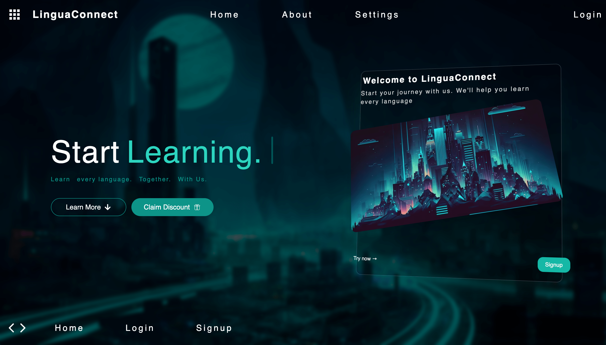
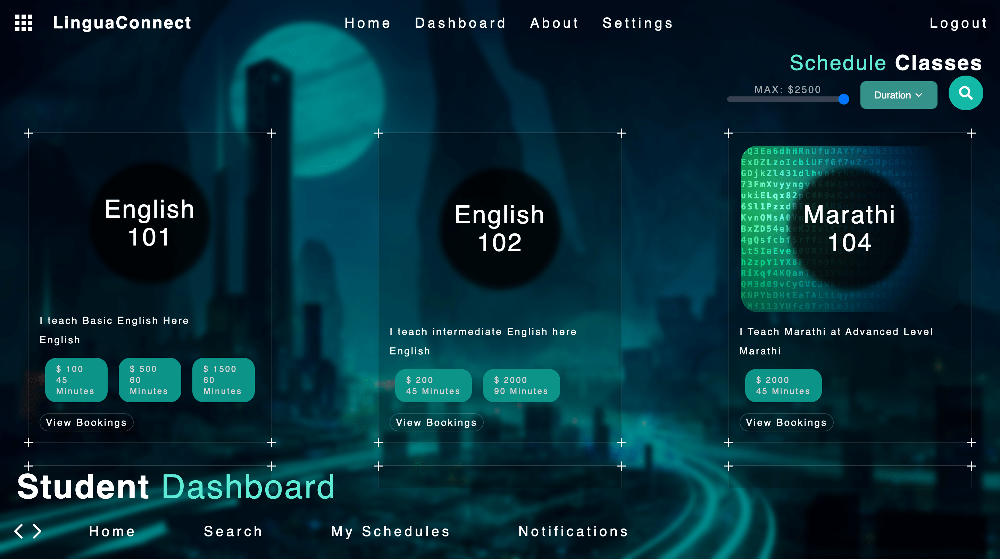
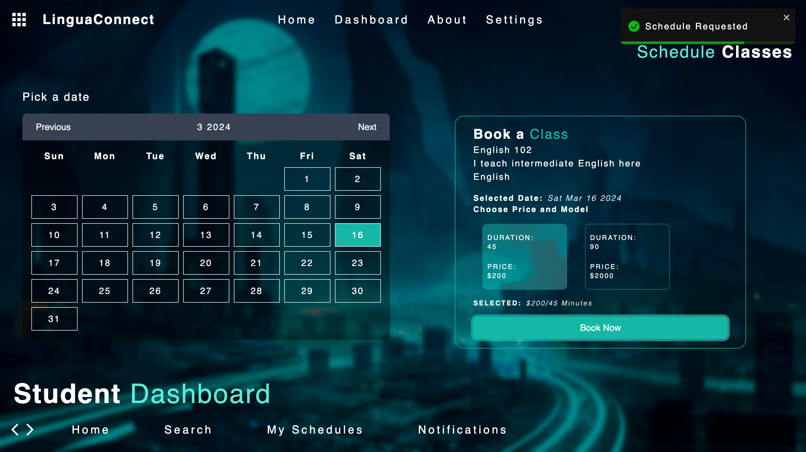

# Lingua Connect

Welcome to Lingua Connect, the language learning platform that connects learners with experienced teachers. This repository contains the source code and documentation for the Lingua Connect application.

#### VIDEO DEMO LINK ->  https://drive.google.com/file/d/16lHnX0Urptk142Z-7CAaxHzF6Rd-isPF/view?usp=sharing

## Overview

Lingua Connect is designed to facilitate language learning by providing a platform where learners can find suitable teachers, schedule classes, and engage in personalized learning experiences.

## Features

- **User Registration:** Users can register as either learners or teachers, based on their roles and preferences.
- **Customizable Classes:** Teachers can create classes with flexible pricing and timing options.
- **Search Functionality:** Users can search for classes based on language, pricing, duration, and other criteria.
- **Schedule Management:** Learners can request to join classes, which teachers can approve or reject.
- **Video Calls:** The platform supports video calls between teachers and learners, with options to share screens and camera feeds.
- **Flashcards:** Users can create and review flashcards for quick learning and revision.
- **AI Integration:** AI features include generating flashcards, providing personalized learning experiences, and offering quizzes.

## Screenshots
 ### Home Page
 

 ### Search/Schedule Class Page
  

 ### Booking Page
  

## Usage

To use Lingua Connect, follow these steps:

1. **Registration:** Sign up as a learner or a teacher.
2. **Explore Classes:** Browse available classes based on your preferences.
3. **Schedule:** Request to join a class and wait for approval from the teacher.
4. **Attend Class:** Join scheduled classes and engage in interactive learning activities.

## Credits

Team ByteMe ❤️

- Saket Aryan
- Fabiha Makhdoomi
